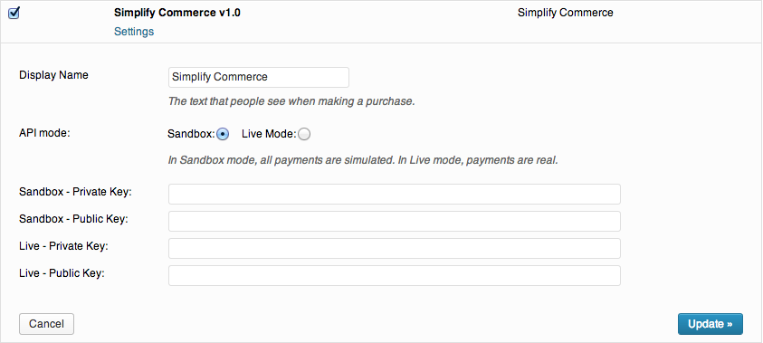

# Simplify Commerce payment gateway for WP e-Commerce

WP e-Commerce is a free WordPress Shopping Cart Plugin that lets customers buy your products and services. This plugin adds Simplify Commerce as a payment option on your WP e-Commerce checkout page.

## Installation
Download the plugin source and copy the contents into your WP e-Commerce directories following the same folder structure. e.g.:
* /wp-e-commerce/wpsc-merchants/simplify.commerce.merchant.php
* /wp-e-commerce/wpsc-merchants/library/simplifycommerce/

## Setup
To use the Simplify Commerce wp-e-commerce plugin you must first create a Simplify account at https://www.simplify.com/commerce/.

To configure the plugin, go to your Wordpress Dashboard -> Settings -> Store -> Payments.  Select Simplify Commerce and enter your Live and/or Sandbox keys.  For information on your API keys go to https://www.simplify.com/commerce/docs/misc/index.

You can manage your Simplify account (view deposits, perform refunds etc.) using the Simplify dashboard at https://www.simplify.com/commerce/.

## Compatibility
This plugin requires WP e-Commerce 3.7.6 or higher

## License
This software is Open Source, released under the BSD 3-Clause license. See [LICENSE.md](LICENSE.md) for more info.
